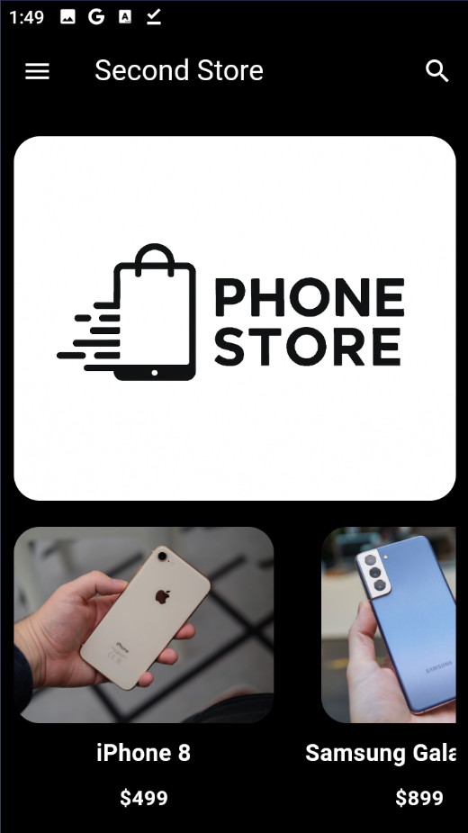
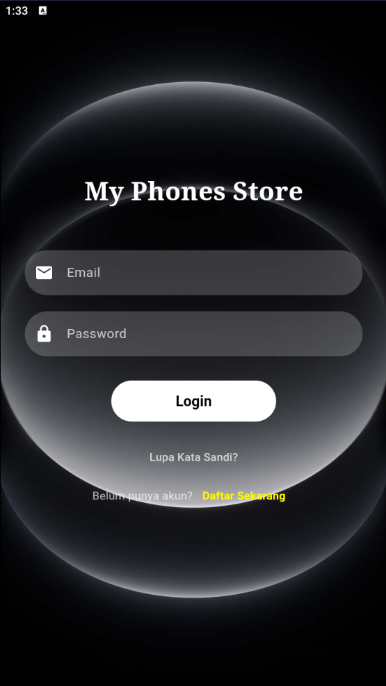
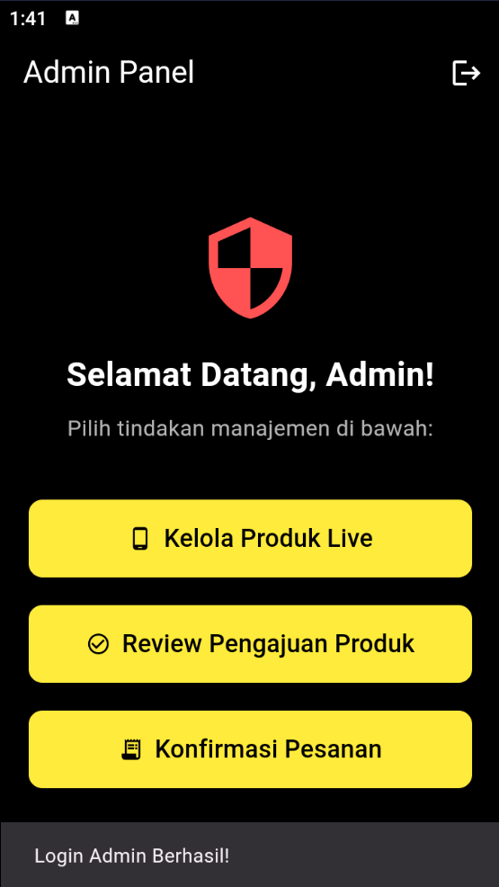
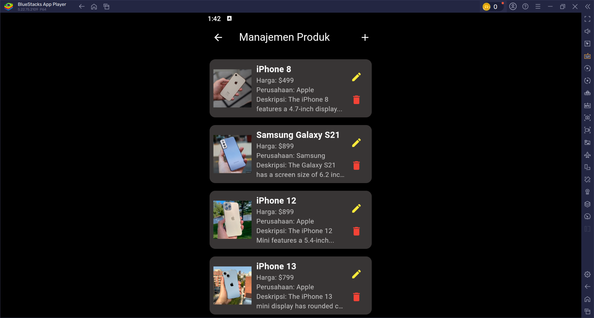
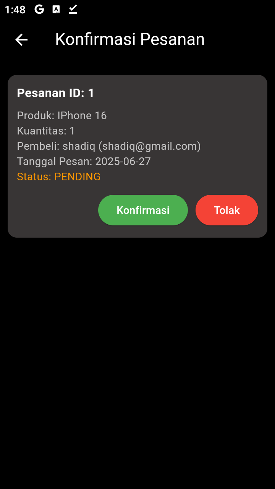
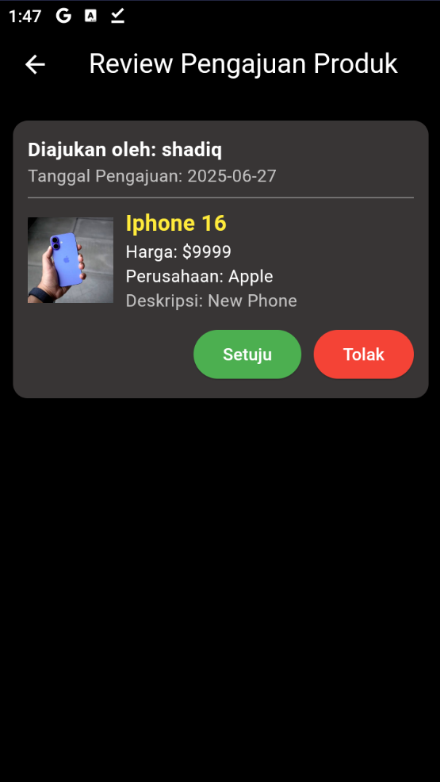
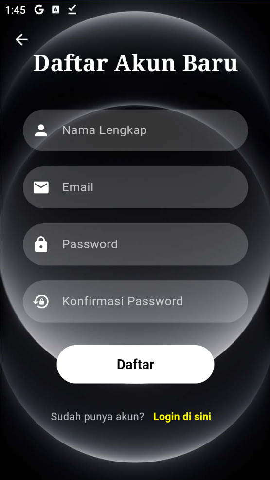
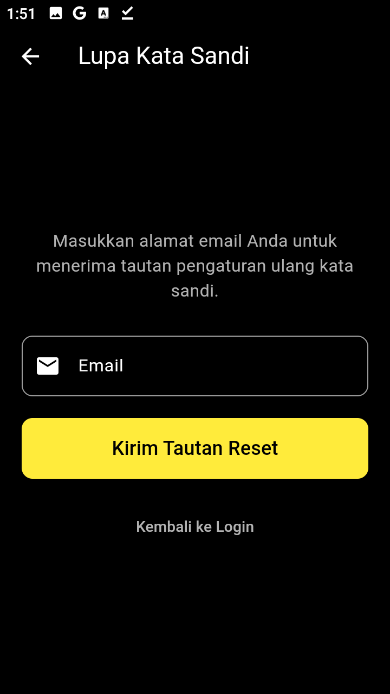

# My Phones Store App

*(Ganti placeholder ini dengan tangkapan layar aplikasi Anda yang sebenarnya! Ambil beberapa tangkapan layar menarik dari layar utama, detail produk, login, ajukan produk, dan panel admin.)*

Berikut adalah beberapa tangkapan layar aplikasi:

### Halaman Beranda

*Menampilkan daftar produk utama.*

### Halaman Login

*Pengguna dapat masuk ke akun mereka.*

### Semua Produk

*Menampilkan daftar lengkap semua produk yang tersedia.*

### Panel Admin

*Dasbor untuk admin mengelola aplikasi.*

### Manajemen Produk

*Admin dapat menambah, mengedit, dan menghapus produk.*

### Konfirmasi Pesanan

*Admin dapat melihat dan mengkonfirmasi pesanan pengguna.*

### Pengajuan Produk

*Pengguna dapat mengajukan produk baru untuk ditinjau admin.*

### Tambah Produk

*Formulir bagi admin untuk menambahkan produk baru.*

### Registrasi Pengguna

*Pengguna baru dapat membuat akun.*

### Lupa Kata Sandi

*Opsi untuk pengguna yang lupa kata sandi mereka.*

---

## Deskripsi Proyek

"My Phones Store" adalah aplikasi mobile e-commerce sederhana yang dibangun dengan Flutter. Aplikasi ini mensimulasikan fungsionalitas dasar sebuah toko ponsel, memungkinkan pengguna untuk menelusuri produk, mendaftar/masuk, mengelola profil mereka, bahkan mengajukan produk baru. Admin memiliki kontrol penuh atas manajemen produk dan konfirmasi pesanan/pengajuan.

Proyek ini dibangun sebagai demonstrasi berbagai konsep pengembangan aplikasi Flutter, termasuk manajemen state lokal, interaksi database lokal (SQLite), navigasi, autentikasi dasar, dan alur kerja multi-peran (pengguna & admin).

## Fitur Utama

Aplikasi ini mencakup fungsionalitas inti berikut:

* **Autentikasi Pengguna:**
    * **Pendaftaran Akun Baru:** Pengguna dapat mendaftar dengan nama lengkap, email, dan password.
    * **Login Pengguna:** Pengguna dapat masuk menggunakan kredensial yang terdaftar.
    * **Login Admin (Dev-only):** Admin dapat login dengan kredensial hardcode (lihat bagian **Catatan Keamanan**).
    * **Lupa Kata Sandi:** Simulasi fitur reset password via email.

* **Manajemen Produk:**
    * **Daftar Produk:** Halaman beranda yang menampilkan daftar produk (horizontal) dan halaman terpisah untuk semua produk (vertikal).
    * **Detail Produk:** Menampilkan informasi detail tentang setiap produk (harga, deskripsi, perusahaan, gambar).

* **Manajemen Profil Konsumen:**
    * Pengguna dapat melihat dan memperbarui nama lengkap, email, dan mengubah password mereka sendiri.

* **Pengajuan Produk oleh Pengguna:**
    * Pengguna biasa dapat **mengajukan produk baru** dengan mengisi detail produk dan **mengunggah gambar langsung dari galeri perangkat**.
    * Pengajuan ini akan berstatus 'pending' dan tidak langsung tampil di beranda utama.

* **Panel Admin (Fitur Eksklusif):**
    * **Manajemen Produk (CRUD):** Admin dapat menambah, melihat, memperbarui, dan menghapus produk yang tampil di beranda aplikasi.
    * **Review Pengajuan Produk:** Admin dapat melihat daftar pengajuan produk dari pengguna, dan memiliki opsi untuk **menyetujui** atau **menolak** pengajuan tersebut.
        * Jika disetujui, produk akan ditambahkan ke daftar produk live.
        * Jika ditolak, pengajuan akan dihapus.
    * **Konfirmasi Pesanan:** Admin dapat melihat pesanan yang diajukan oleh pengguna dan **mengkonfirmasinya**.
        * Ketika pesanan dikonfirmasi, produk yang bersangkutan secara otomatis **dihapus dari daftar produk live**, mensimulasikan bahwa produk tersebut telah terjual.

* **Penyimpanan Data Lokal:**
    * Pengguna, Produk, Pengajuan Produk, dan Pesanan semuanya disimpan di database **SQLite** lokal perangkat menggunakan library `sqflite`.

* **User Interface (UI) & User Experience (UX):**
    * Desain gelap yang konsisten di seluruh aplikasi.
    * Animasi transisi sederhana pada layar Login dan Splash Screen.
    * Validasi form dasar untuk input pengguna.
    * Navigasi Drawer yang intuitif.

---

## Tumpukan Teknologi

* **Flutter:** Framework UI untuk membangun aplikasi mobile native.
* **Dart:** Bahasa pemrograman yang digunakan oleh Flutter.
* **sqflite:** Plugin Flutter untuk menggunakan database SQLite lokal.
* **shared_preferences:** Plugin Flutter untuk menyimpan data key-value sederhana secara persisten.
* **image_picker:** Plugin Flutter untuk memilih gambar dari galeri atau kamera.
* **path_provider:** Plugin Flutter untuk mendapatkan lokasi umum di sistem file perangkat.

---

## Struktur Proyek

Struktur direktori `lib/` diatur secara modular untuk pemisahan tanggung jawab:
